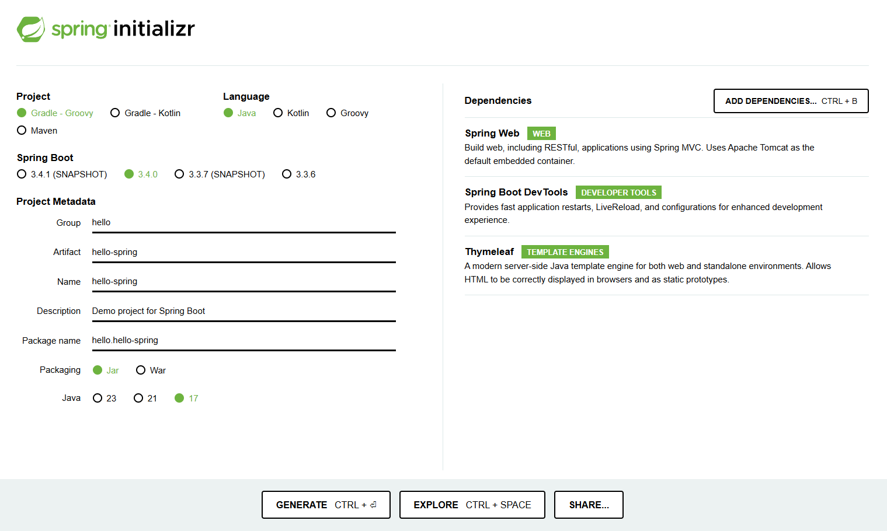
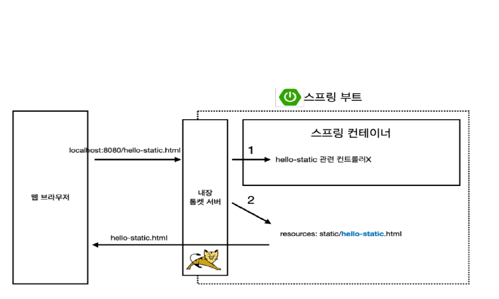
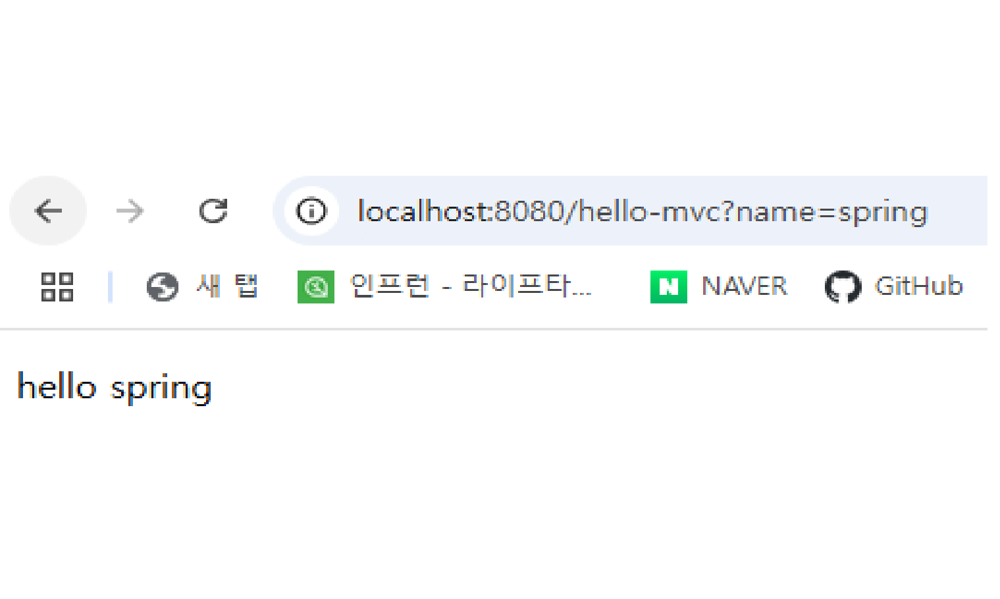
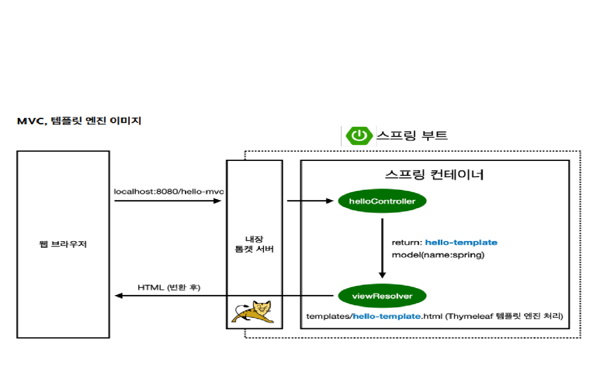
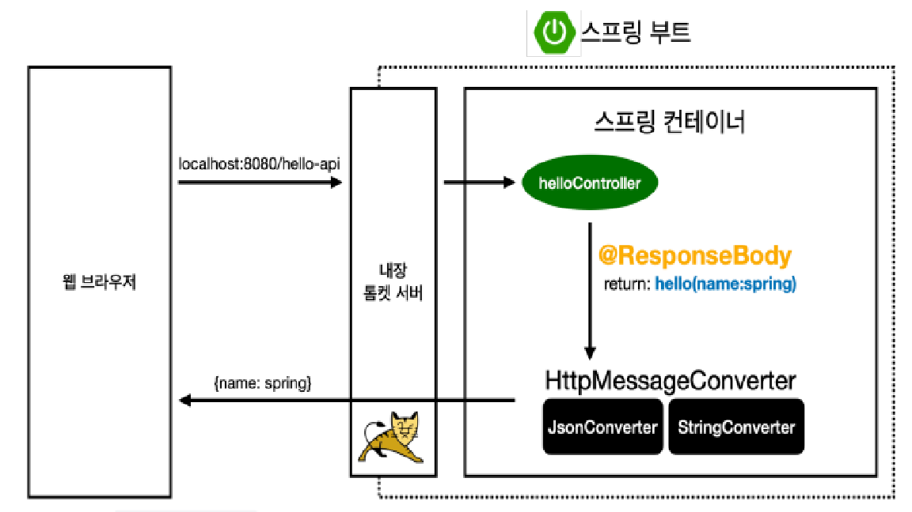

## 스프링 웹 개발 기초
> 1. 프로젝트 생성
> 2. 정적 컨텐츠
> 3. MVC와 템플릿 엔진
> 4. API
---

### 프로젝트 생성
- https://start.spring.io/


---

### 정적 컨텐츠
- 스프링 부트 정적 컨텐츠 기능
  ```java
  <!DOCTYPE HTML>
  <html>
  <head>
   <title>static content</title>
   <meta http-equiv="Content-Type" content="text/html; charset=UTF-8" />
  </head>
  <body>
  정적 컨텐츠 입니다.
  </body>
  </html>
  ```
- `localhost:8080/hello-static.html` 접속가능 
- 정적 컨텐츠 이미지


- 정적 파일은 resources/static 폴더 내 저장
- url에 `localhost:8080/hello-static.html` 작성 시 내장 톰캣 서버가 스프링으로 넘긴다.
- 컨트롤러에 없으면 정적 파일을 찾아서 화면으로 출력

---

### MVC와 템플릿 엔진
- MVC: Model, View, Controller
- Controller
    ```java
    @Controller
    public class HelloController {
     @GetMapping("hello-mvc")
     public String helloMvc(@RequestParam("name") String name, Model model) {
     model.addAttribute("name", name);
     return "hello-template";
     }
    }
    ```
- View
    ```java
    resources/templates/hello-template.html
    
    <html xmlns:th="http://www.thymeleaf.org">
    <body>
    <p th:text="'hello ' + ${name}">hello! empty</p>
    </body>
    </html>
    ```
- `localhost:8080/hello-mvc?name=spring` 접속가능

- MVC, 템플릿 엔진 이미지


  - url `localhost:8080/hello-mvc` 접속 후 내장 톰캣 서버가 스프링으로 넘긴다.
  - 외부에서 파라미터를 받아온다.
  - model.addAttribute(key, value)를 사용하므로 url 창에 넘긴 파라미터를 적음으로써 Thymeleaf 템플릿 엔진 처리 요청

---
### API
- `@ResponseBody` 문자 반환
```java
@Controller
public class HelloController {
 @GetMapping("hello-string")
 @ResponseBody
 public String helloString(@RequestParam("name") String name) {
 return "hello " + name;
 }
}
```
  - `localhost:8080/hello-string?name=spring` 접속가능
  - `@ResponseBody` 를 사용하면 뷰 리졸버( viewResolver )를 사용하지 않음
  - 대신에 HTTP의 BODY에 문자 내용을 직접 반환

- `@ResponseBody` 객체 반환
```java
@Controller
public class HelloController {
    
 @GetMapping("hello-api")
 @ResponseBody
 public Hello helloApi(@RequestParam("name") String name) {
    Hello hello = new Hello();
    hello.setName(name);
    return hello;
 }
 
 static class Hello {
     
   private String name;
   
   public String getName() {
   return name;
   }
   
   public void setName(String name) {
   this.name = name;
   }
 
 }
}
```
  - `localhost:8080/hello-api?name=spring` 접속 가능
  - `@ResponseBody` 를 사용하고, 객체를 반환하면 객체가 JSON으로 변환됨
- `@ResponseBody` 사용 원리


  - `@ResponseBody` 를 사용
    - HTTP의 BODY에 문자 내용을 직접 반환
    - `viewResolver` 대신에 `HttpMessageConverter` 가 동작
    - 기본 문자처리: `StringHttpMessageConverter`
    - 기본 객체처리: `MappingJackson2HttpMessageConverter`

