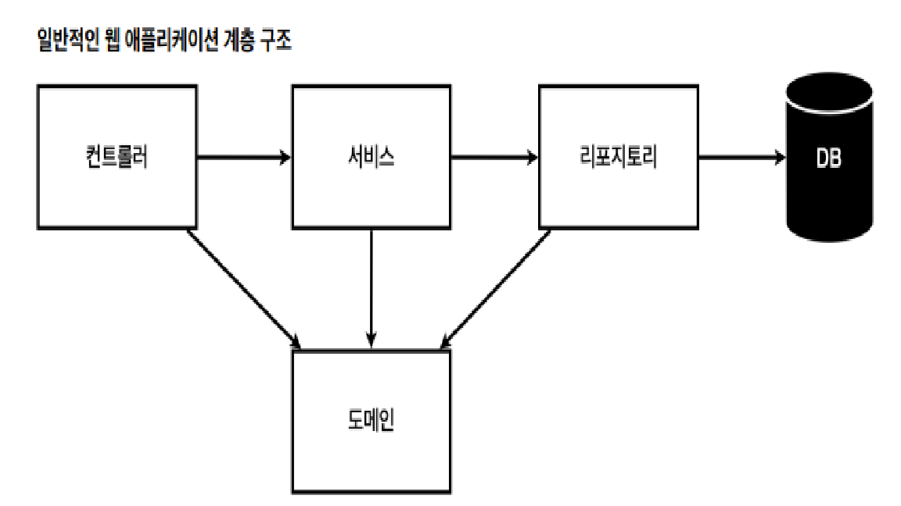
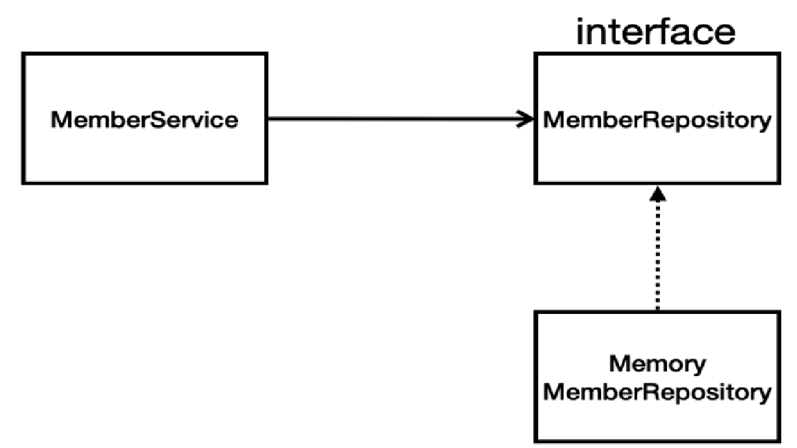

## 회원 관리 예제- 백엔드 개발
> 1. 비즈니스 요구사항 정리
> 2. 회원 도메인과 리포지토리 만들기
> 3. 회원 리포지토리 테스트 케이스 작성
> 4. 회원 서비스 개발
> 5. 회원 서비스 테스트
---

### 비즈니스 요구사항 정리
- 데이터 : 회원ID, 이름
- 기능 : 회원 등록, 조회
- 아직 데이터 저장소가 선정되지 않음(가상의 시나리오)

  - 컨트롤러 : 웹 MVC의 컨트롤러 역할
  - 서비스 : 핵심 비즈니스 로직 구현
  - 리포지토리 : 데이터베이스에 접근, 도메인 객체를 DB에 저장하고 관리
  - 도메인 : 비즈니스 도메인 객체, 예)  회원, 주문, 쿠폰 등등 주로 데이터베이스에 저장하고 관리
- 클래스 의존 관계

  - 아직 데이터 저장소가 선정되지 않아서, 우선 인터페이스로 구현 클래스를 변경할 수 있도록 설계
  - 데이터 저장소는 RDB, NoSQL 등등 다양한 저장소를 고민중인 상황으로 가정
  - 개발을 진행하기 위해서 초기 개발 단계에서는 구현체로 가벼운 메모리 기반의 데이터 저장소 사용
---

### 회원 도메인과 리포지토리 만들기
- 회원 객체
  ```java
  public class Member {
  
     private Long id;
     
     private String name;
     
     public Long getId() {
        return id;
     }
     
     public void setId(Long id) {
        this.id = id;
     }
     
     public String getName() {
        return name;
     }
     
     public void setName(String name) {
        this.name = name;
     }
   
  }
  ```
- 회원 리포지토리 인터페이스
  ```java
  import hello.hellospring.domain.Member;
  
  import java.util.List;
  import java.util.Optional;
  
  public interface MemberRepository {
    Member save(Member member); //저장
    Optional<Member> findById(Long id); //id값으로 회원 찾기
    Optional<Member> findByName(String name);   //이름으로 회원 찾기
    List<Member> findAll(); //전체 조회
  }
  ```
  
- 회원 리포지토리 메모리 구현체
```java
import hello.hellospring.domain.Member;

import java.util.*;

public class MemoryMemberRepository implements MemberRepository {
 private static Map<Long, Member> store = new HashMap<>();
 
 private static long sequence = 0L; //1씩 증가 시키기 위한 시퀀스
 
 @Override
 public Member save(Member member) {
   member.setId(++sequence);    //member에 id값 추가
   store.put(member.getId(), member);   //store에 저장
   return member;
 }
 
 @Override
 public Optional<Member> findById(Long id) {
   return Optional.ofNullable(store.get(id));   //Optional로 null인지 확인 가능
 }
 
 @Override
 public List<Member> findAll() {
   return new ArrayList<>(store.values());
 }
 
 @Override
 public Optional<Member> findByName(String name) {
   return store.values().stream()
   .filter(member -> member.getName().equals(name))
   .findAny();
 }
 
 public void clearStore() { //Test시 하나 종료하면 정리하기 위한 메소드
   store.clear();
 }
}
```
---

### 회원 리포지토리 테스트 케이스 작성
- 개발한 기능을 실행해서 테스트 할 때 자바의 main 메서드를 통해서 실행하거나, 웹 애플리케이션의 컨트롤러를 통해
  서 해당 기능을 실행한다. 이러한 방법은 준비하고 실행하는데 오래 걸리고, 반복 실행하기 어렵고 여러 테스트를 한번
  에 실행하기 어렵다는 단점이 있다. 자바는 JUnit이라는 프레임워크로 테스트를 실행해서 이러한 문제를 해결한다.
- 회원 리포지토리 메모리 구현체 테스트
  ```java
  import hello.hellospring.domain.Member;
  import org.junit.jupiter.api.AfterEach;
  import org.junit.jupiter.api.Test;
  
  import java.util.List;
  import java.util.Optional;
  
  import static org.assertj.core.api.Assertions.*;
  
  class MemoryMemberRepositoryTest {
   MemoryMemberRepository repository = new MemoryMemberRepository();
  
   @AfterEach
   public void afterEach() {
    repository.clearStore();
   }
  
   @Test
   public void save() {
    //given
    Member member = new Member();
    member.setName("spring");
    //when
    repository.save(member);
    //then
    Member result = repository.findById(member.getId()).get();
    assertThat(result).isEqualTo(member);
   }
  
   @Test
    public void findByName() {
    //given
    Member member1 = new Member();
    member1.setName("spring1");
    repository.save(member1);
    Member member2 = new Member();
    member2.setName("spring2");
    repository.save(member2);
    //when
    Member result = repository.findByName("spring1").get();
    //then
    assertThat(result).isEqualTo(member1);
   }
  
   @Test
   public void findAll() {
    //given
    Member member1 = new Member();
    member1.setName("spring1");
    repository.save(member1);
    Member member2 = new Member();
    member2.setName("spring2");
    repository.save(member2);
    //when
    List<Member> result = repository.findAll();
    //then
    assertThat(result.size()).isEqualTo(2);
   }
  }
  ```
    - Assertions.assertThat().isEqualsTo()로 객체와 내부 값이 동일 한지 비교 가능
    - 테스트 전체 실행 시 순서는 랜덤이기에 테스트 하나 끝나면 클리어 해주기 위해 @AfterEach 사용
    - @AfterEach : 한번에 여러 테스트를 실행하면 메모리 DB에 직전 테스트의 결과가 남을 수 있다. 이렇게
      되면 다음 이전 테스트 때문에 다음 테스트가 실패할 가능성이 있다. @AfterEach 를 사용하면 각 테스트가 종료
      될 때 마다 이 기능을 실행한다. 여기서는 메모리 DB에 저장된 데이터를 삭제한다
    - 테스트는 각각 독립적으로 실행되어야 한다. 테스트 순서에 의존관계가 있는 것은 좋은 테스트가 아니다.
---
### 회원 서비스 개발
```java
import hello.hellospring.domain.Member;
import hello.hellospring.repository.MemberRepository;

import java.util.List;
import java.util.Optional;

public class MemberService {
 private final MemberRepository memberRepository = new MemoryMemberRepository();

 public Long join(Member member) {  //회원가입
    validateDuplicateMember(member); //중복 회원 검증
    memberRepository.save(member);
    return member.getId();
 }

  private void validateDDuplicateMember(Member member) {    //회원 이름으로 중복확인 로직
    Optional<Member> result = memberRepository.findByName(member.getName());
    result.ifPresent(m -> { //null이 아니라 값이 있으면
      throw new IllegalStateException("이미 존재하는 회원입니다.");
    });
  }
 
 public List<Member> findMembers() {    //전체 회원 조회
    return memberRepository.findAll();
 }
 
 public Optional<Member> findOne(Long memberId) {
    return memberRepository.findById(memberId);
 }
}
```
---

### 회원 서비스 테스트
- 기존에는 회원 서비스가 메모리 회원 리포지토리를 직접 생성하게 했다.
  ```java
  public class MemberService {
  
   private final MemberRepository memberRepository = new MemoryMemberRepository();
  }
  ```
- 회원 서비스 코드를 DI(의존성) 가능하게 변경 가능
```java
public class MemberService {
    
 private final MemberRepository memberRepository;
 
 public MemberService(MemberRepository memberRepository) {
     
    this.memberRepository = memberRepository;
 }

}
```
- 회원 서비스 테스트
  ```java
  import hello.hellospring.domain.Member;
  import hello.hellospring.repository.MemoryMemberRepository;
  import org.junit.jupiter.api.BeforeEach;
  import org.junit.jupiter.api.Test;
  
  import static org.assertj.core.api.Assertions.*;
  import static org.junit.jupiter.api.Assertions.*;
  
  class MemberServiceTest {
   MemberService memberService;
   MemoryMemberRepository memberRepository;
  
   @BeforeEach
   public void beforeEach() {
   memberRepository = new MemoryMemberRepository();
   memberService = new MemberService(memberRepository);
   }
  
   @AfterEach
   public void afterEach() {
   memberRepository.clearStore();
   }
  
   @Test
   public void 회원가입() throws Exception {
   //Given
   Member member = new Member();
   member.setName("hello");
   //When
   Long saveId = memberService.join(member);
   //Then
   Member findMember = memberRepository.findById(saveId).get();
   assertEquals(member.getName(), findMember.getName());
   }
  
   @Test
   public void 중복_회원_예외() throws Exception {
   //Given
   Member member1 = new Member();
   member1.setName("spring");
   Member member2 = new Member();
   member2.setName("spring");
   //When
   memberService.join(member1);
   IllegalStateException e = assertThrows(IllegalStateException.class,
   () -> memberService.join(member2));//예외가 발생해야 한다.
   assertThat(e.getMessage()).isEqualTo("이미 존재하는 회원입니다.");
   }
  }
  ```
  - `@BeforeEach` 각 테스트 실행 전에 호출된다. 테스트가 서로 영향이 없도록 항상 새로운 객체를 생성하
    고, 의존관계도 새로 맺어준다.